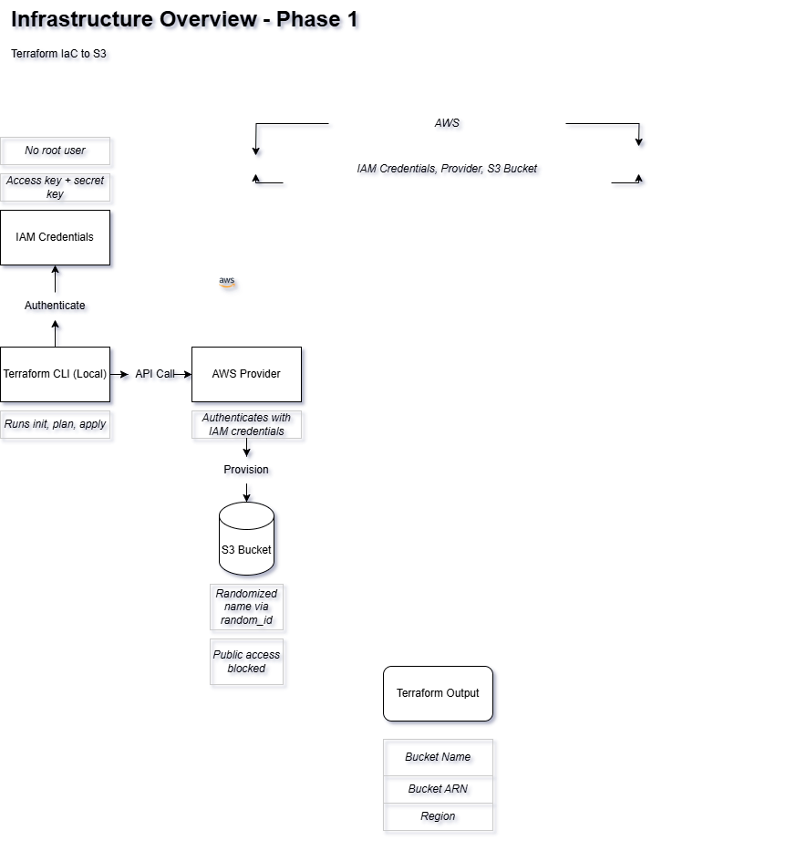
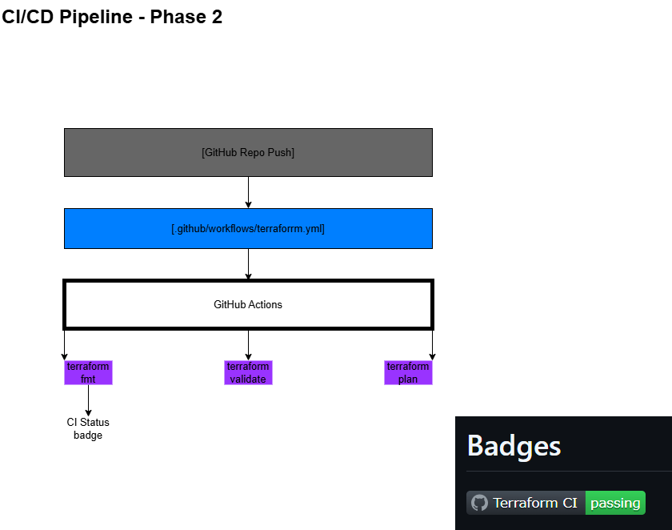
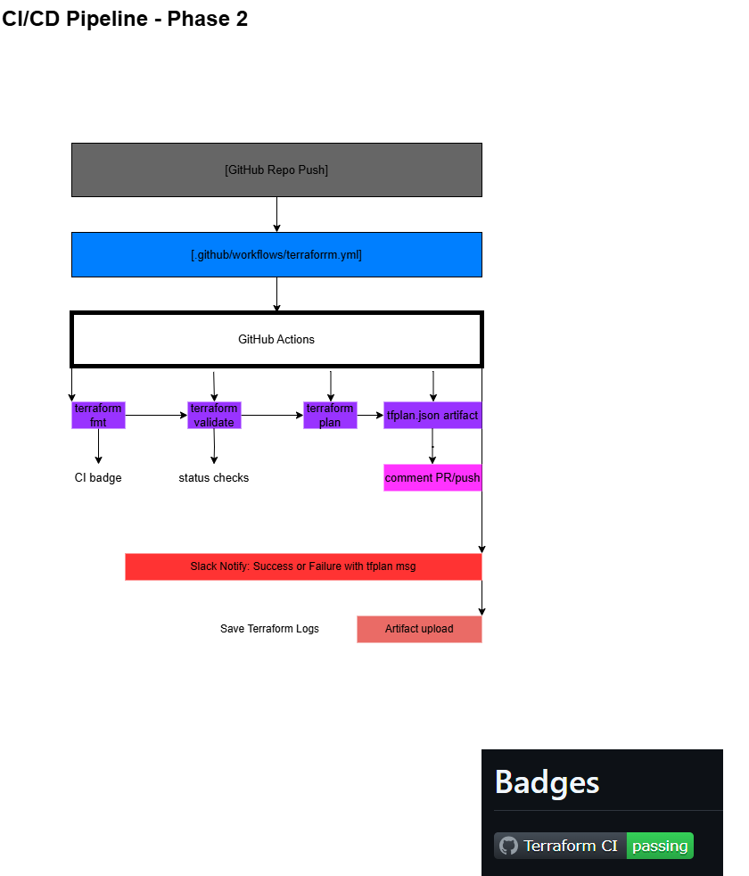

# JobIntel: A Cloud-Native DevOps Job Tracker

JobIntel is a **fully automated, cert-mapped job application tracker** powered by Terraform, AWS, GitHub Actions, and Slack.

It transforms job hunting into a **cloud-native, production-grade pipeline**. Integrating with **CI/CD, observability, observability, resume versioning, and rejection pattern analysis**.

---

## Why JobIntel?

Traditional job tracking tools are **static** with spreadsheets, Notion boards, and manual entries.

JobIntel applies **DevOps principles** to career anagement:

- **Terraform-Provisioned Infrastructure** -> S3 storage for resume version tracking

- **CI/CD Pipeline via GitHub Actions** -> Automated Terraform valudation & deployment

- **Slack Alerts for Job Applications** -> Real-time notifications for success & failure

- **Observability & Intelligence Layer** -> Track patterns in job applicationn rejections

**JobIntel is built in phases, aligning with real-world DevOps tooling and certifications.**

---

## Badges & Live Autiomation

### Slack Alerts Triggered by GitHub Actions

Terraform runs send real-time Slack messages on success & failure.

#### Live Demo

---

## Overview

JobIntel was built while studying foor cloud certifications and job hunting remotely.

I wanted something **better than spreadsheets or Notion**. I wanted **automation, infrastructure, and actionable insights**.

### Key Components

- Full Terraform infrastructure for job tracking

- Automated resume hosting via AWS S3

- CI/CD pipelines integrating Slack alerts

- AI-powered rejection pattern analysis

- Certification-aligned architecture

#### Project Phases

- **Phases 1–2**: Iac, CI/CD, Terraform workflows

- **Phase 3**: Observability, structured tfplan parsing, Slack log enrichment

- **Phase 4+**: Python backend, resume versioning, CLI, NLP intelligence

---

## Design Principles

JobIntel follows **real-world infrastructure best practices**:

- **Secrets managed via GitHub Environments**

- **CI/CD gated by environment filtering**

- **Terraform plan artifacts uploaded as GitHub Actions**

- **Slack alerts scoped to production failures**

- **Each phase is cert-mapped for cert-alignment**

### Architecture Diagrams

Each diagram showcases **Terraform infrastructure evolution & automation pipelines**.

### Infra Overview (Terraform to AWS S3)

Terraform provisioning to AWS S3 using secure IAM access.

---

### CI/CD Pipelines (GitHub Actions | CI/CD Systems)

Terraform CI/CD pipeline powered by GitHub Actions and Slack. Built for security, clarity, and real-world DevOps readiness.

---

### Observability Flow (Fail → Detect → Recover)

Mapping system errors, logs, and fallback response flow for production-grade observability. Track job rejections, Slack alerts, and feeds analytics to ML/NLP layer.

---

## Cert Mapped Layers

| Layer                    | Tech Stack                             | Mapped Certification(s)           | Status            |
|--------------------------|----------------------------------------|-----------------------------------|-------------------|
| Infrastructure as Code   | Terraform, AWS (S3, Lambda, IAM)       | Terraform Associate, AWS SA Pro   |  Phase 1 Complete |
| CI/CD Pipelines          | GitHub Actions                         | DevOps Mastery                    |  Phase 2 Complete |
| Observability & Logging  | Slack, Terraform tf Parsing            | Cloud Security (Future)           |  Planned          |
| Resume Automation        | S3 hosting, Python automation          | Python, Cloud AI                  |  Planned          |

---

## Real-World Impact

JobIntel mirrors **production DevOps workflows**, helping build practical expertise in infrastructure automation.

| Feature                               | Real-World Job Skill                     |
|---------------------------------------|------------------------------------------|
| Slack alerting for Terraform failures | On-call observability & CI/CD monitoring |
| Secure GitHub Actions pipeline        | Environment-based deployments            |
| Terraform + AWS IAM + S3              | Infrastructure-as-Code provisioning      |
| tfplan artifact storage               | Debugging infrastructure failures        |
| AI-based resume scoring               | Future job insights automation           |

---

## Repositories

JobIntel is a **modular**, with separate repositories for each component:

- [`Terraform IaC`](https://github.com/destiny-malone/jobintel-IaC)

- [`Python backend`](https://github.com/destiny-malone/jobintel-api)

- [`GitHub Actions, Terraform automation`](https://github.com/destiny-malone/jobintel-cicd)

- [`Documentation & cert tracking`](https://github.com/destiny-malone/jobintel-cli)

### For full technical breakdown, see [See full breakdown.](PROJECT_OVERVIEW.md)

---

## Why I Built This

Because **job hunting deserves DevOps, too**.

I was **studying, building, and applying simultaneously**. JobIntel let me do all three **in one place**.

It's my **resume, job-tracker, and a proof-of-concept for real-worls infrastructure automation**.

---

## **License**

MIT — Feel free to **fork**, **build**, and **remix**. 

---
